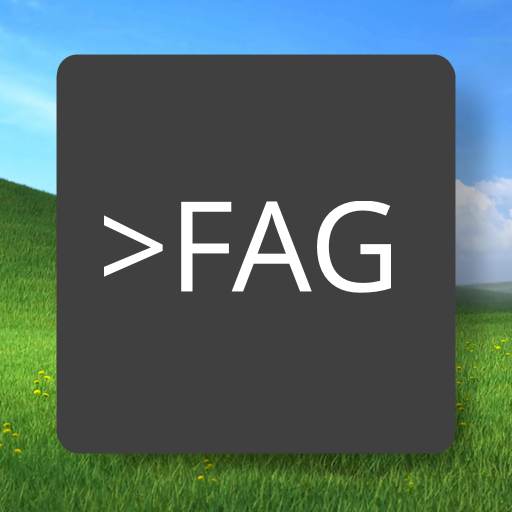

# FAG Theme

<!--  -->

> **F**edora **A**dwaita **G**nome — a VS Code color theme.  
> Yes, the acronym spells FAG. No, we are not sorry. It stands for Linux, deal with it.

A clean, minimal VS Code color theme inspired by [GNOME's Adwaita](https://gnome.pages.gitlab.gnome.org/libadwaita/) design language and [Fedora](https://fedoraproject.org/)'s color palette. Available in 7 accent colors × dark/light = **14 themes**.

> 🇷🇺 [Читать на русском](README.ru.md) · [Roadmap](ROADMAP.md)


## Installation

### 1. Install the extension

**Via VS Code Marketplace** *(coming soon)*

**Manually:**
1. Download the latest `.vsix` from [Releases](https://github.com/DionisiuBrovka/fag-color-theme/releases)
2. Open VS Code → `Ctrl+Shift+P` → `Extensions: Install from VSIX...`
3. Select the downloaded file

**Apply the theme:**  
`Ctrl+Shift+P` → `Preferences: Color Theme` → search for `FAG`


### 2. Recommended VS Code settings

For the best experience, add these to your `settings.json`  
(`Ctrl+Shift+P` → `Open User Settings (JSON)`):

```jsonc
"editor.renderLineHighlight": "none",
"explorer.compactFolders": false,
"breadcrumbs.enabled": false,
"window.titleBarStyle": "custom",
"window.menuBarVisibility": "compact",
"window.autoDetectColorScheme": true,
"workbench.iconTheme": null,
"workbench.tree.indent": 14,
"workbench.layoutControl.enabled": false,
"workbench.browser.showInTitleBar": true,
"workbench.preferredDarkColorTheme": "FAG-green dark color theme",
```


### 3. GNOME Shell — Rounded Window Corners

For the full Adwaita feel, install a rounded corners extension for GNOME Shell:

- **GNOME 45 and older:** [yilozt/rounded-window-corners](https://github.com/yilozt/rounded-window-corners)
- **GNOME 46+:** [flexagoon/rounded-window-corners](https://github.com/flexagoon/rounded-window-corners)  
  *(GNOME 50 support is not yet available)*


### 4. Custom UI Style

Install [vscode-custom-ui-style](https://github.com/subframe7536/vscode-custom-ui-style) by subframe7536.

Not required right now, but will be used in upcoming versions of the theme to style additional VS Code UI elements that the standard theme API doesn't expose.


## Building Locally

The JSON files in `themes/` are generated — **do not edit them by hand**.

### How it works

- **`src/tokens.py`** — single source of truth for all colors. Contains `COLORS_TOKENS` (base palette, panel/foreground/border scales for dark and light) and `ACCENT_COLORS_TOKENS` (per-accent tints, shades, and transparent variants).
- **`src/build.py`** — reads the tokens and writes one JSON theme file per `(accent × brightness)` combination into `themes/`.

### Rebuild after editing tokens

```bash
npm run build:color-themes
```

This runs `cd src && python build.py` and regenerates all 14 theme files.


## Author

**Dionisiu Brovka**

- GitHub: [DionisiuBrovka](https://github.com/DionisiuBrovka)
- Email: [dionisiu.brovka@gmail.com](mailto:dionisiu.brovka@gmail.com)
- Telegram: [t.me/goppi](https://t.me/goppi)
