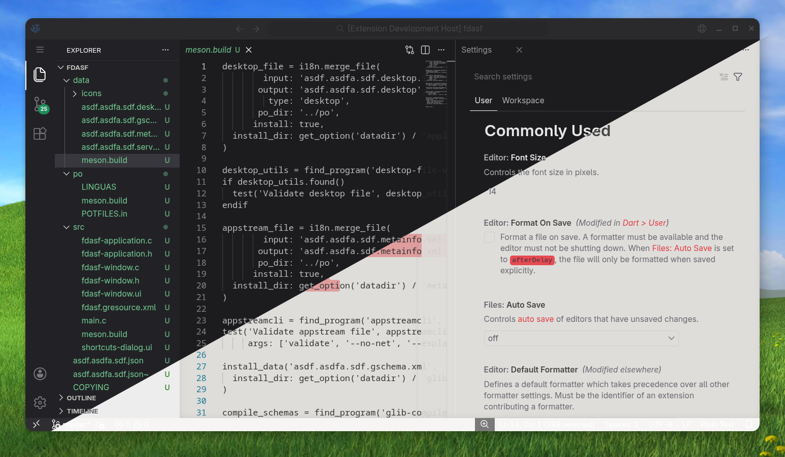

<p align="center">
  
</p>

<h1 align="center">Fedora Adwaita Gnome theme</h1>

> **F**edora **A**dwaita **G**nome — цветовая тема для VS Code.  
> Да, аббревиатура получилась FAG. Нет, нам не стыдно. Это Linux, привыкайте.

Чистая минималистичная тема для VS Code, вдохновлённая дизайн-языком [Adwaita](https://gnome.pages.gitlab.gnome.org/libadwaita/) от GNOME и цветовой палитрой [Fedora](https://fedoraproject.org/). Доступна в 7 акцентных цветах × тёмный/светлый = **14 тем**.

> 🇬🇧 [Read in English](README.md) · [Roadmap](ROADMAP.md)



## Установка

### 1. Установка расширения

**Через VS Code Marketplace** *(скоро)*

**Вручную:**
1. Скачай последний `.vsix` из [Releases](https://github.com/DionisiuBrovka/fag-color-theme/releases)
2. Открой VS Code → `Ctrl+Shift+P` → `Extensions: Install from VSIX...`
3. Выбери скачанный файл

**Применить тему:**  
`Ctrl+Shift+P` → `Preferences: Color Theme` → найди `FAG`


### 2. Рекомендуемые настройки VS Code

Для лучшего внешнего вида добавь эти настройки в `settings.json`  
(`Ctrl+Shift+P` → `Open User Settings (JSON)`):

```jsonc
"editor.renderLineHighlight": "none",
"explorer.compactFolders": false,
"breadcrumbs.enabled": false,
"window.titleBarStyle": "custom",
"window.menuBarVisibility": "compact",
"window.autoDetectColorScheme": true,
"workbench.iconTheme": null,
"workbench.tree.indent": 14,
"workbench.layoutControl.enabled": false,
"workbench.browser.showInTitleBar": true,
```


### 3. GNOME Shell — скруглённые углы окон

Для полного ощущения Adwaita установи расширение скруглённых углов для GNOME Shell:

- **GNOME 45 и старше:** [yilozt/rounded-window-corners](https://github.com/yilozt/rounded-window-corners)
- **GNOME 46+:** [flexagoon/rounded-window-corners](https://github.com/flexagoon/rounded-window-corners)  
  *(поддержка GNOME 50 пока недоступна)*


### 4. Custom UI Style

Установи [vscode-custom-ui-style](https://github.com/subframe7536/vscode-custom-ui-style) от subframe7536.

Сейчас не обязательно, но будет использоваться в следующих версиях темы для стилизации элементов VS Code, которые стандартный API тем не позволяет изменять.


## Сборка локально

JSON-файлы в папке `themes/` генерируются автоматически — **не редактируй их вручную**.

### Как это работает

- **`src/tokens.py`** — единственный источник всех цветов. Содержит `COLORS_TOKENS` (базовая палитра, шкалы панелей/текста/рамок для тёмного и светлого режима) и `ACCENT_COLORS_TOKENS` (оттенки, тени и прозрачные варианты акцентов).
- **`src/build.py`** — читает токены и записывает один JSON-файл темы на каждую комбинацию `(акцент × яркость)` в папку `themes/`.

### Пересборка после изменения токенов

```bash
npm run build:color-themes
```

Запускает `cd src && python build.py` и перегенерирует все 14 файлов тем.


## Автор

**Dionisiu Brovka**

- GitHub: [DionisiuBrovka](https://github.com/DionisiuBrovka)
- Email: [dionisiu.brovka@gmail.com](mailto:dionisiu.brovka@gmail.com)
- Telegram: [t.me/goppi](https://t.me/goppi)
